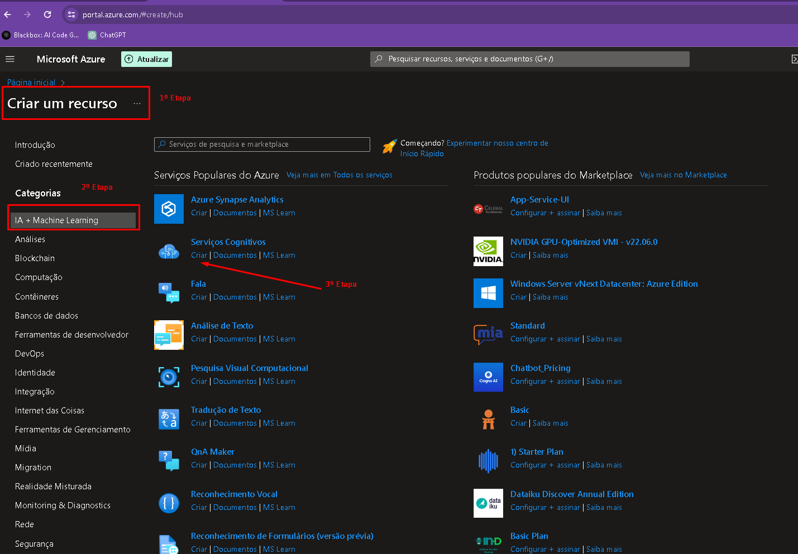
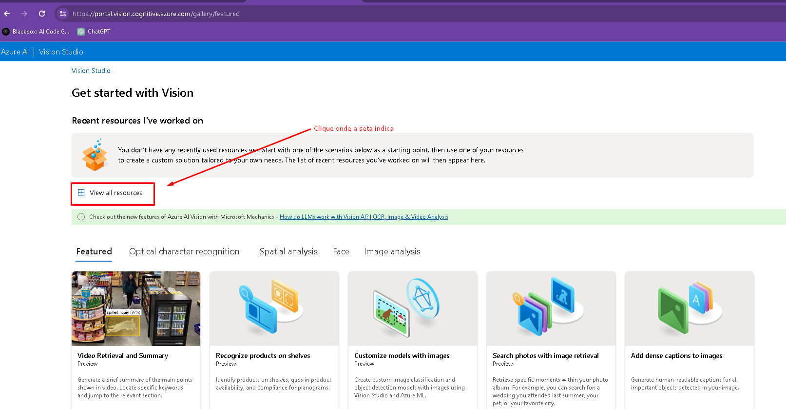
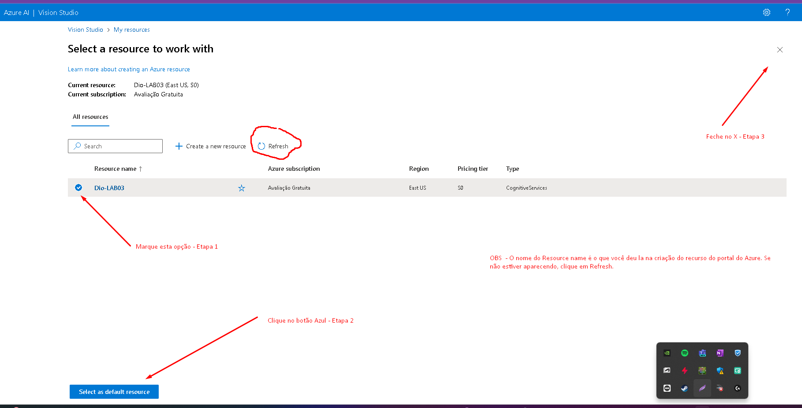
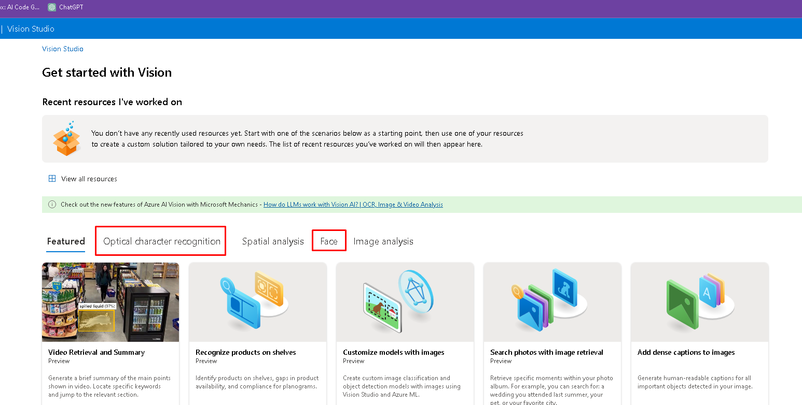
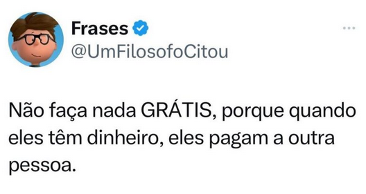
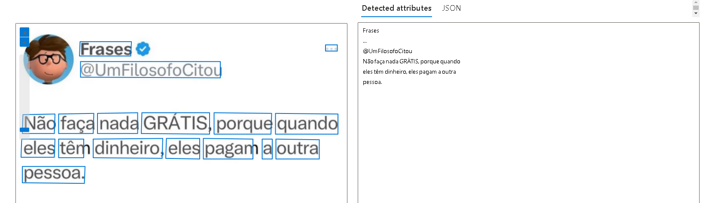

# DIO - Azure Vision Studio

Projeto utilizando Ferramenta poderosa no Azure Cloud. Estamos falando do Azure Studio e o portal de Serviços Cognitivos vinculados ao Azure.

## Como chegar lá?

Acesse o [Azure](https://azure.com) e logue com sua conta. Caso não tenha crie uma gratuita.

* Caso precise criar uma conta gratuita, será necessário informar um cartão de credito válido. A microsoft libera um credito para você usar dentro do azure, mas fica com um cartão caso haja excessos.

* Assim que acessar o Portal do Azure, clique em "Criar um recurso" e depois no menu a esquerda, clique em "IA + Machine Learning" e por ultimo na segunda opção "Serviços Cognitivos".

Recurso criado, vamos para o portal do [Vision Studio](https://portal.vision.cognitive.azure.com/).

Faça o login com sua conta gratuita ou não, criada la no portal Azure.

Conectado ao Vision Studio, clique na imagem abaixo para visualizar os recursos disponiveis e selecione conforme a imagem abaixo:

Na pagina de "all Resources", selecione o recurso criado anteriormente, conforme imagen abaixo:

Apos o passo acima, estamos prontos para usar dois recuros:*   

* Optical character recognition (OCR)
* Face

## Ex 1 - Reconhecendo pesosas em uma Prova de ciclismo🚴🚴🚴

O Ciclista  da Foto é Mathias van der Poel, holandes na prova do campeonato mundial de ciclismo destrada disputada em AGosto de 2023, na cidade Galsgow - Escócia.

Ao passamros a imagem acima no detector de Faces, vemos que claramente a ferramenta reconhece as faces nitidas de praticamente todos nas fotos.

## Ex 2 - Tweet na plataforma X, utilizando o OCR para capitação de texto em imagens.

Neste exemeplo a ferramenta de OCR consegue separar muito bem todo o textos e referencias de usuario, para um TXT comom e separado por linhas!

Há outros exemplos nas pastas inputs e output para análise ou mesmo para uso no [Vision Studio](https://portal.vision.cognitive.azure.com/)
## Insights 

O uso de Ferramentas de IA podem ser muito amplas e benéficas caso utilizdas de forma correta.

Por exemplo o OCR, leitura de texto em imagens, poderia ser isado facilmente por empresas para digitalização de notas e pagamentos de reembolsos. Desde que estruturado, poderíamos enviar os dados até um banco de dados em ERP utilziado e automatizar todo o processo de lançamento e pagamento das mesmas.

De maneira correta, poderia haver redução de recursos desprendidos em tarefas manuais e que necessitam de pouca capacitação, sem falar no tempo desprendido de quem lança e quem confere.

Para o caso de detecção de imagens, meu insights é para aquelas empresas que vende serviços em forma de mão de obra. Imagina ter medido quanto tempo o colaborador passa na frente no PC. Eu sei que isso não garante que ele esteja trabalhando, mas melhorar a assertividade de horas produtivas para futuros orçamentos, poderia refletir em crescer ou fechar uma empresa!

## Referência

 - [Documentação face detect](https://aka.ms/ai900-face)
 - [Documentação OCR](https://aka.ms/ai900-ocr)
 - [Portal Azure](https://portal.azure.com)
 - [Vision Studio](https://portal.vision.cognitive.azure.com)
## 😊Autores

- [@lerocha1](https://www.github.com/lerocha1)

## 🚀 Sobre mim
Pai, ciclista e apaixonado por Tecnologia, atuo como Gerente multidisciplinar em uma empresa de engenharia e que nas horas vagas "gasto" meu tempo com programação e desafios na internet.

Programando marjoritariamente em Python, também especialista em banco de Dados, Analise de dados/Big Data e programador FullStack.

